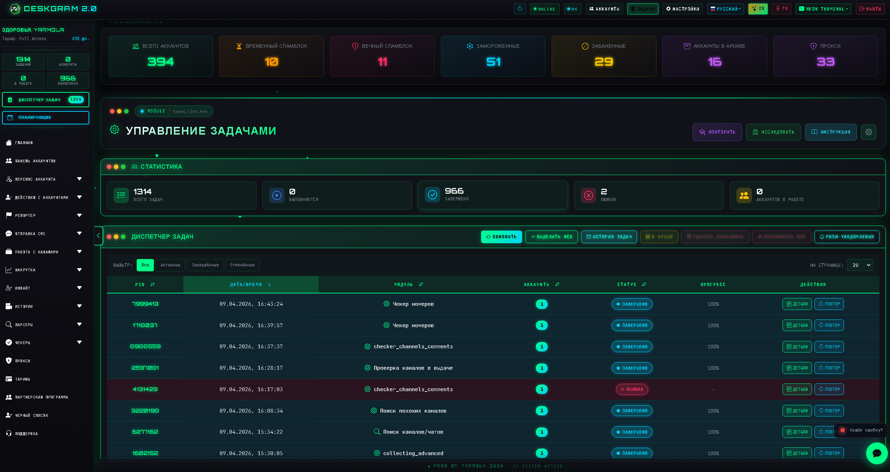
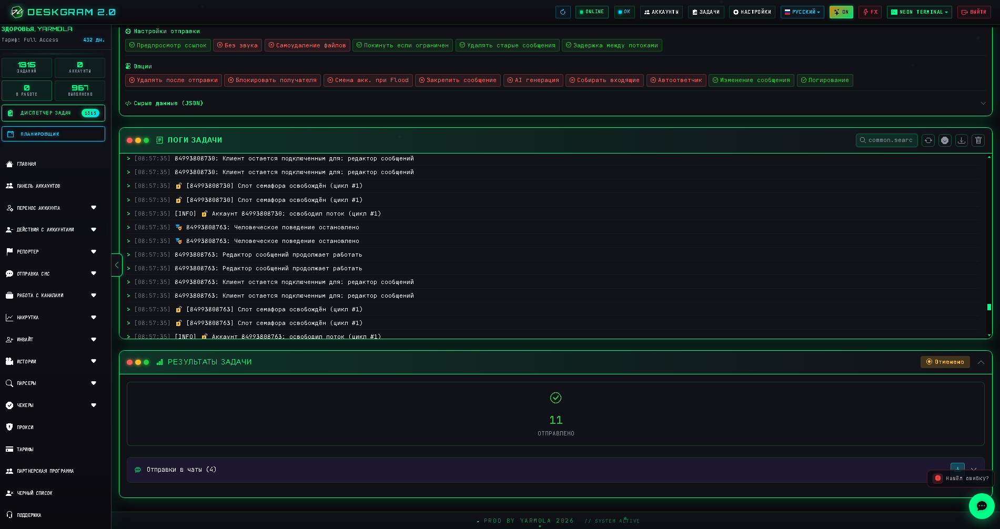
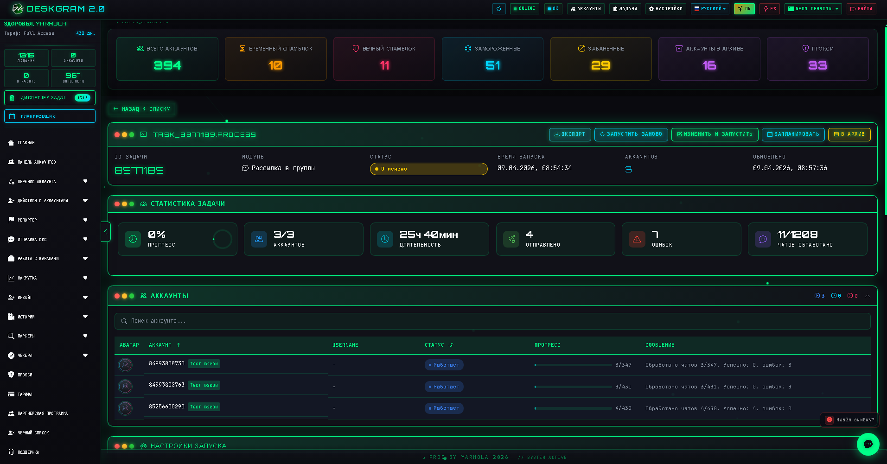

# Диспетчер задач Telegram в Deskgram 2

Диспетчер задач в Deskgram 2 — это раздел для мониторинга, фильтрации и управления запущенными сценариями Telegram-автоматизации. Он объединяет статистику, действия по задачам, историю и контроль выполнения в одном месте.

[Главный хаб Deskgram 2](https://github.com/Deskgram-2/deskgram-2-telegram-automation) · [Сайт](https://deskgram2.com/) · [Telegram-бот](https://t.me/DG2welcomebot) · [Web preview](https://deskgram2.com/web-preview)
## Интерактивный Web Preview

Попробовать модуль в браузере: [Открыть веб-превью](https://deskgram2.com/app-demo/tasks)

Планировщик задач: [Открыть веб-планировщик](https://deskgram2.com/web-preview?path=%2Fapp-demo%2Fscheduler)

## Кратко о разделе

| Параметр | Что внутри |
|---|---|
| Основная задача | Контроль и управление задачами Deskgram 2 |
| Что помогает делать | Смотреть статистику, фильтровать задачи, открывать историю и останавливать сценарии |
| Полезен для | Операторов, которые ведут несколько одновременных процессов |
| Важные зоны | Дашборд статистики, панель действий, фильтры, таблица задач |
| Связанные разделы | Нейрокомментинг, Рассылка в ЛС, Инвайт |

## Что умеет диспетчер задач

- показывать сводную статистику по задачам;
- разделять запущенные, завершенные и ошибочные сценарии;
- быстро переходить к истории задач;
- останавливать все задачи при необходимости;
- фильтровать таблицу по нужным параметрам;
- держать текущую операционную картину в одном окне.

## Быстрый старт

1. Откройте раздел задач после запуска рабочих модулей.
2. Оцените сводный дашборд по активным и завершенным процессам.
3. Используйте фильтры и действия для нужной группы задач.
4. При необходимости откройте историю или остановите проблемный сценарий.
5. Контролируйте итог по статистике и карточкам задач.

## Какие сценарии здесь логично контролировать

- [Нейрокомментинг](https://github.com/Deskgram-2/telegram-neuro-commenting-deskgram), когда важно видеть AI-активность и ошибки в комментариях;
- [Рассылка в ЛС](https://github.com/Deskgram-2/telegram-direct-messaging-deskgram), когда нужно держать под контролем массовые сообщения;
- [Сбор аудитории](https://github.com/Deskgram-2/telegram-audience-parser-deskgram), если парсинг идет параллельно по нескольким источникам;
- [Инвайт](https://github.com/Deskgram-2/telegram-invite-tool-deskgram), когда важны лимиты, статусы и проблемные задачи;
- [Вступление в группы](https://github.com/Deskgram-2/telegram-join-groups-deskgram), если вы следите за прогрессом по аккаунтным сценариям.

## Интерфейс раздела

### Главный экран

На основном экране находятся таблица задач, фильтры и панель действий.

### Дашборд статистики

Дашборд показывает общее количество задач, активные процессы, завершения, ошибки и аккаунты в работе.

### Карточка задачи

Карточка помогает быстро понять состояние сценария и перейти к деталям конкретного запуска.

## Когда особенно полезен

- когда одновременно работают несколько модулей;
- когда нужно быстро понимать, что выполняется прямо сейчас;
- когда важно вовремя ловить ошибки и подвисшие сценарии;
- когда операционная работа строится вокруг постоянного контроля задач.

## Почему это удобнее ручного мониторинга

| Ручной подход | Диспетчер задач в Deskgram 2 |
|---|---|
| Статусы приходится собирать по разным окнам | Есть единый дашборд и таблица задач |
| Сложно быстро оценить масштаб загрузки | Видна сводная статистика по всем процессам |
| История и активные сценарии разрознены | Есть централизованный контроль и история |
| Остановка проблемных задач занимает время | Есть быстрые действия из интерфейса |
| Ошибки легко пропустить | Они видны в статистике и карточках задач |

## Сценарии применения

- контроль параллельных кампаний, когда одновременно работают [парсинг](https://github.com/Deskgram-2/telegram-audience-parser-deskgram), [рассылка в ЛС](https://github.com/Deskgram-2/telegram-direct-messaging-deskgram) и [инвайт](https://github.com/Deskgram-2/telegram-invite-tool-deskgram);
- наблюдение за AI-модулями вроде [нейрокомментинга](https://github.com/Deskgram-2/telegram-neuro-commenting-deskgram), если важно быстро ловить ошибки и подвисшие процессы;
- операционный контроль после подготовки инфраструктуры, когда база аккаунтов уже собрана, а сценарии идут потоком;
- единая точка мониторинга для команды, если в Deskgram 2 параллельно запускаются несколько разных направлений работы.

## Что выбрать: диспетчер задач или панель аккаунтов

| Если ваша задача | Что подходит лучше |
|---|---|
| Смотреть, какие сценарии сейчас запущены и в каком они состоянии | `Диспетчер задач` |
| Собрать рабочую группу аккаунтов под новый запуск | [Панель аккаунтов](https://github.com/Deskgram-2/telegram-account-manager-deskgram) |
| Быстро остановить проблемный процесс и проверить историю | `Диспетчер задач` |
| Управлять самой базой аккаунтов, а не выполнением сценариев | [Панель аккаунтов](https://github.com/Deskgram-2/telegram-account-manager-deskgram) |

## Смежные репозитории

- [Главный хаб Deskgram 2](https://github.com/Deskgram-2/deskgram-2-telegram-automation)
- [Нейрокомментинг](https://github.com/Deskgram-2/telegram-neuro-commenting-deskgram)
- [Рассылка в ЛС](https://github.com/Deskgram-2/telegram-direct-messaging-deskgram)
- [Сбор аудитории](https://github.com/Deskgram-2/telegram-audience-parser-deskgram)
- [Инвайт](https://github.com/Deskgram-2/telegram-invite-tool-deskgram)
- [Вступление в группы](https://github.com/Deskgram-2/telegram-join-groups-deskgram)

## FAQ

### Для чего нужен этот раздел, если модули уже показывают свой прогресс?

Он собирает операционную картину в одном месте и помогает не переключаться между разными окнами.

### Можно ли через него быстро понять, где проблемы?

Да. Для этого и нужен дашборд со статистикой, ошибками и статусами задач.

### Чем он особенно полезен команде?

Тем, что делает мониторинг более прозрачным и уменьшает хаос при параллельных сценариях.

### Когда лучше открывать диспетчер задач?

Практически всегда, когда у вас идет активная работа сразу по нескольким модулям.

## Полезные ссылки

- [Главный хаб Deskgram 2](https://github.com/Deskgram-2/deskgram-2-telegram-automation)
- [Сайт Deskgram 2](https://deskgram2.com/)
- [Telegram-бот Deskgram 2](https://t.me/DG2welcomebot)
- [Web preview](https://deskgram2.com/web-preview)
